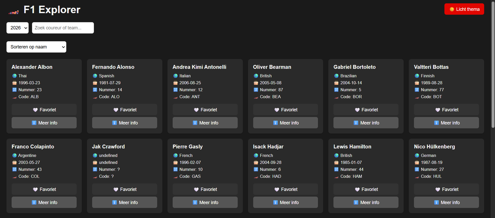
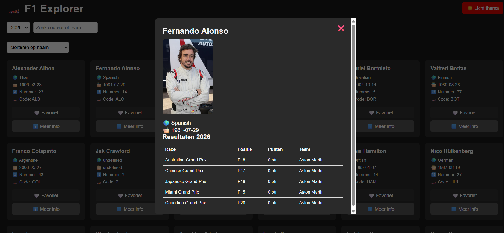
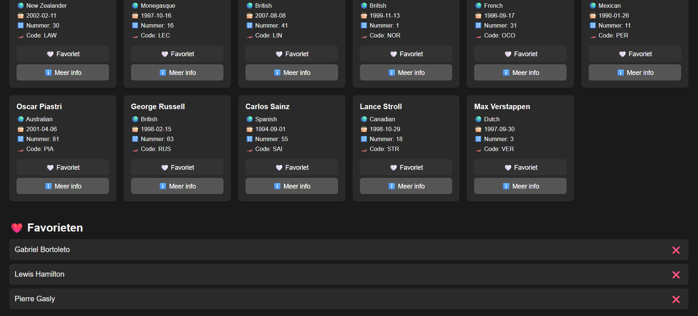

# 🏎️ F1 Explorer

Een webapplicatie om Formula 1-data te verkennen van 2016 tot nu.

---

## Beschrijving

F1 Explorer haalt data op van de Jolpica F1 API en toont coureurs, teams en races per seizoen. Gebruikers kunnen zoeken, filteren, sorteren en favorieten opslaan. De voorkeuren (favorieten, thema en seizoen) blijven bewaard tussen sessies via LocalStorage.

---

## Functionaliteiten

- Overzicht van coureurs per seizoen (2016–heden)
- Detailweergave per coureur in een modal (foto van Wikipedia + raceresultaten van dat seizoen)
- Zoeken op naam of nationaliteit
- Sorteren op naam of nationaliteit
- Favorieten opslaan (blijft bewaard na herladen)
- Licht/donker thema met opslag in LocalStorage
- Fade-in animatie bij het scrollen (IntersectionObserver)
- Formuliervalidatie op de zoekfunctie

---

## Gebruikte API

- [Jolpica F1 API](https://api.jolpi.ca/ergast/f1/) — gratis, geen API-sleutel nodig
- [Wikipedia REST API](https://en.wikipedia.org/api/rest_v1/) — voor de foto van de coureur

---

## Technische vereisten

| Concept | Bestand | Lijnnummer |
|---------|---------|-----------|
| DOM selectie (`querySelector`) | src/js/app.js | regel 7–10 |
| DOM manipulatie (`createElement`, `innerHTML`) | src/js/render.js | regel 16–18 |
| Event handlers (`addEventListener`) | src/js/app.js | regel 110–113 |
| const | src/js/app.js | regel 7 |
| Template literals | src/js/render.js | regel 19–28 |
| Array iteratie (`forEach`) | src/js/app.js | regel 14 |
| Array methodes (`.filter`) | src/js/app.js | regel 35 |
| Array methodes (`.sort`) | src/js/app.js | regel 42 |
| Array methodes (`.map` / `.join`) | src/js/render.js | regel 84–96 |
| Array methodes (`.some`) | src/js/render.js | regel 14 |
| Arrow functions | src/js/app.js | regel 12 |
| Ternary operator | src/js/app.js | regel 65 |
| Callback functions | src/js/app.js | regel 15 |
| Promises (`.json()` / fetch) | src/js/api.js | regel 2–3 |
| Async / Await | src/js/api.js | regel 1–4 |
| IntersectionObserver (Observer API) | src/js/render.js | regel 53–61 |
| Fetch | src/js/api.js | regel 2 |
| JSON manipulatie | src/js/api.js | regel 3–4 |
| LocalStorage | src/js/storage.js | regel 5–7 |
| Formuliervalidatie | src/js/app.js | regel 27–34 |

---

## Screenshots

---

## Bronnen

- [Jolpica F1 API docs](https://github.com/jolpica/jolpica-f1/blob/main/docs/README.md)
- [Vite docs](https://vitejs.dev/)
- [MDN Web Docs](https://developer.mozilla.org/)
- AI chatlog: zie `ai-log.md`